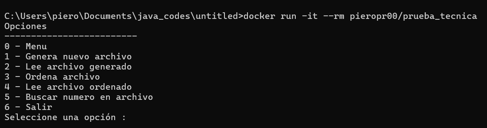

# Prueba técnica - BENNU

Programa de consola en Java que genera un archivo .txt de números aleatorios, los ordena comparando cuatro algoritmos y permite buscar un número en él.

## Recomendación: Ejecutar con Docker

Lo más recomendable es ejecutarlo con Docker con:

```
docker run -it --rm pieropr00/prueba_tecnica
```

El `-it` es necesario porque el programa lee las opciones desde el teclado.




## Menú

| Opción | Acción |
|--------|--------|
| 0 | Muestra el menú |
| 1 | Genera `numeros.txt` con la cantidad de números aleatorios que indiques (de 1 a 100000) |
| 2 | Muestra el archivo generado |
| 3 | Ordena el archivo con los cuatro algoritmos, muestra el tiempo de cada uno y guarda `numeros_ordenados.txt` el cual es el archivo con los numeros ordenados |
| 4 | Muestra el archivo ordenado, si aún no se ha ordenado los numeros no se va a mostrar |
| 5 | Busca un número en el archivo |
| 6 | Borra los archivos y sale |

Detalles de funcionamiento:

- Los números generados van de 0 a 99999, uno por línea.
- La opción 5 usa búsqueda binaria si ya existe el archivo ordenado; si no, usa simple búsqueda lineal sobre el archivo generado.
- Al generar un archivo nuevo se borra el ordenado anterior, porque ya no corresponde a los números nuevos.

## Algoritmos

| Algoritmo | Complejidad |
|-----------|-------------|
| Bubble Sort | O(n²) |
| Insertion Sort | O(n²) en promedio, O(n) si ya está casi ordenado |
| Merge Sort | O(n log n) |
| Quick Sort | O(n log n) en promedio, O(n²) en el peor caso |
| Búsqueda lineal | O(n) |
| Búsqueda binaria | O(log n), requiere el archivo ordenado |

## Estructura

```
src/
├── Main.java                 Punto de entrada
├── App.java                  Menú y flujo del programa
├── repository/
│   └── NumberFileRepository  Lee y escribe los números en archivos de texto
├── sort/
│   ├── SortStrategy          Interfaz que implementa cada algoritmo
│   ├── BubbleSort, InsertionSort, MergeSort, QuickSort
│   └── SortBenchmark         Ejecuta cada algoritmo y mide su tiempo
└── search/
    ├── LinearSearch
    └── BinarySearch
```

Los algoritmos de ordenamiento siguen el patrón Strategy: para agregar uno nuevo basta con implementar `SortStrategy` y añadirlo en `SortBenchmark.withDefaults()`.


## Para ejecutar en local (sin Docker)

Requiere Java 17 o superior. Desde la raíz del proyecto, en PowerShell:

```
javac -encoding UTF-8 -d out (Get-ChildItem -Recurse src -Filter *.java).FullName
java -cp out Main
```